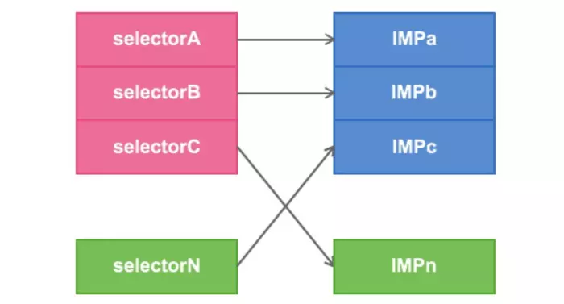
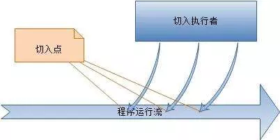
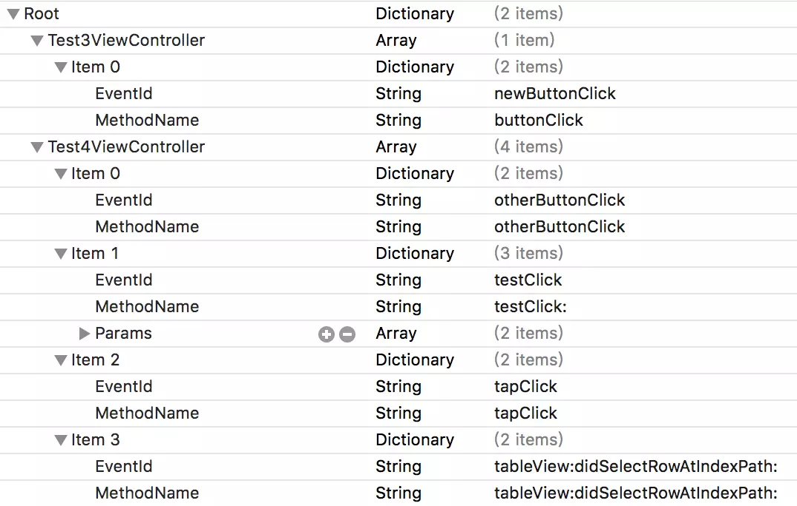

# Method Swizzling 机制与AOP编程的应用

### 1. 场景需求

* 统计UIViewController加载次数
* 统计UIButton点击次数
* 统计自定义方法的执行
* 统计UITableView的Cell点击事件

工程说明，首页Test1ViewController，其中有4个按钮，点击第一个按钮打印，第二个到第四个按钮分别跳转到Test2ViewController，Test3ViewController，Test4ViewController。

> 技术选型：

* 手动复制统计的代码逻辑一个个地粘贴到需要统计的类和方法中去。工作量大，可维护性差，仅适用统计埋点极少的情况。
* 通过继承和重写系统方法 -- 利用写好统计的一个基类，让需要VC继承自该基类，或者调用重写过统计逻辑的按钮基类等等。
* 简单的分类，添加类方法或者示例方法 -- 将统计逻辑封装在分类方法里面，在需要统计的地方导入并调用分类方法。
* 替换系统方法的分类：通过运行时Runtime的办法 -- 利用Method Swizzling机制进行方法替换：替换原来的需要在里面统计却不含统计逻辑的方法 为 新的包含了统计逻辑的方法。
* 通过AOP的方法 -- 利用Aspect框架对需要进行统计的方法进行挂钩（hook），并注入包含了统计逻辑的代码块（block）。

### 2. 为VC设计的分类：运行时Method Swizzling方案



> 场景需求：需要监听全局的某一类的同一方法

这种方案被监听的方法单一，但会影响全局的所有的类的该方法。例如下面的分类，即使你不`import`，只要存在于工程就会影响。

* UIViewController+Trace

```text
#import "UIViewController+Trace.h"
#import "TraceHandler.h"
#import <objc/runtime.h>
#import <objc/objc.h>
#import "Aspects.h"


@implementation UIViewController (Trace)

#pragma mark - 1.自定义实现方法
+ (void)load{
    swizzleMethod([self class], @selector(viewDidAppear:), @selector(swizzled_viewDidAppear:));
}

- (void)swizzled_viewDidAppear:(BOOL)animated{
    // call original implementation
    [self swizzled_viewDidAppear:animated];
    // Begin statistics Event
    [TraceHandler statisticsWithEventName:@"UIViewController"];
}

void swizzleMethod(Class class,SEL originalSelector,SEL swizzledSelector){
    // the method might not exist in the class, but in its superclass
    Method originalMethod = class_getInstanceMethod(class, originalSelector);
    Method swizzledMethod = class_getInstanceMethod(class, swizzledSelector);

    // class_addMethod will fail if original method already exists
    BOOL didAddMethod = class_addMethod(class, originalSelector, method_getImplementation(swizzledMethod), method_getTypeEncoding(swizzledMethod));

    // the method doesn’t exist and we just added one
    if (didAddMethod) {
        class_replaceMethod(class, swizzledSelector, method_getImplementation(originalMethod), method_getTypeEncoding(originalMethod));
    }
    else {
        method_exchangeImplementations(originalMethod, swizzledMethod);
    }
}

@end
```

* TraceHandler.m

```text
#import "TraceHandler.h"

@implementation TraceHandler

+ (void)statisticsWithEventName:(NSString *)eventName{
    NSLog(@"-----> %@",eventName);
}

@end
```

### 3. 为VC设计的分类：AOP编程方案



> 场景需求：该方案的适用特点同上第二节。

[Aspects](https://link.jianshu.com/?t=https%3A%2F%2Fgithub.com%2Fsteipete%2FAspects) 是iOS平台一个轻量级的面向切面编程\(AOP\)框架，只包括两个方法：一个类方法，一个实例方法。

```text
+ (id<AspectToken>)aspect_hookSelector:(SEL)selector
                      withOptions:(AspectOptions)options
                       usingBlock:(id)block
                            error:(NSError **)error;
```

```text
- (id<AspectToken>)aspect_hookSelector:(SEL)selector
                      withOptions:(AspectOptions)options
                       usingBlock:(id)block
                            error:(NSError **)error;
```

函数使用方式简单易懂，挂钩的方式为三种：

```text
typedef NS_OPTIONS(NSUInteger, AspectOptions) {
    AspectPositionAfter   = 0,            /// 在原始方法后调用（默认）
    AspectPositionInstead = 1,            /// 替换原始方法
    AspectPositionBefore  = 2,            /// 在原始方法前调用
    
    AspectOptionAutomaticRemoval = 1 << 3 /// 在执行1次后自动移除
};
```

调用示例代码：

```text
[UIViewController aspect_hookSelector:@selector(viewWillAppear:) withOptions:AspectPositionAfter usingBlock:^(id<AspectInfo> aspectInfo, BOOL animated) {
    NSLog(@"View Controller %@ will appear animated: %tu", aspectInfo.instance, animated);
} error:NULL];
```

这段代码是给UIViewController的viewWillAppear:挂钩一个Block，在原始方法执行完成后，打印字符串。

* UIViewController+Trace

```text
#pragma mark - 2.使用Aspects框架
+ (void)load{
    [UIViewController aspect_hookSelector:@selector(viewDidAppear:)
                              withOptions:AspectPositionAfter
                               usingBlock:^(id<AspectInfo>aspectInfo){
                                   NSString *className = NSStringFromClass([[aspectInfo instance] class]);;
                                   [TraceHandler statisticsWithEventName:className];
                               } error:nil];
}
```

### 4. 为全局AppDelegate设计的分类：AOP编程方案

> 场景需求：需要监听不同类，不同按钮，系统方法，及表单元点击事件

**方案特点**：是可代码配置需要监听的清单字典，并且需要注入的统计代码块block也可以写在这个清单里面。

* AppDelegate+Trace.m

```text
#import "AppDelegate+Trace.h"
#import "TraceManager.h"

@implementation AppDelegate (Trace)

+ (void)setupLogging{
    NSDictionary *configDic = @{
                                @"ViewController":@{
                                        @"des":@"show ViewController",
                                        },
                                @"Test1ViewController":@{
                                        @"des":@"show Test1ViewController",
                                        @"TrackEvents":@[@{
                                                             @"EventDes":@"click action1",
                                                             @"EventSelectorName":@"action1",
                                                             @"block":^(id<AspectInfo>aspectInfo){
                                                                 NSLog(@"统计 Test1ViewController action1 点击事件");
                                                             },
                                                             },
                                                         @{
                                                             @"EventDes":@"click action2",
                                                             @"EventSelectorName":@"action2",
                                                             @"block":^(id<AspectInfo>aspectInfo){
                                                                 NSLog(@"统计 Test1ViewController action2 点击事件");
                                                             },
                                                             }],
                                        },
                                @"Test2ViewController":@{
                                        @"des":@"show Test2ViewController",
                                        }
                                };
    
    [TraceManager setUpWithConfig:configDic];
}

@end
```

* TraceManager.m

```text
#import "TraceManager.h"

@import UIKit;

typedef void (^AspectHandlerBlock)(id<AspectInfo> aspectInfo);

@implementation TraceManager

+ (void)setUpWithConfig:(NSDictionary *)configDic{
    // hook 所有页面的viewDidAppear事件
    [UIViewController aspect_hookSelector:@selector(viewDidAppear:)
                              withOptions:AspectPositionAfter
                               usingBlock:^(id<AspectInfo> aspectInfo){
                                   dispatch_async(dispatch_get_global_queue(DISPATCH_QUEUE_PRIORITY_DEFAULT, 0), ^{
                                       NSString *className = NSStringFromClass([[aspectInfo instance] class]);
                                       NSString *des = configDic[className][@"des"];
                                       if (des) {
                                           NSLog(@"%@",des);
                                       }
                                   });
                               } error:NULL];
    
    for (NSString *className in configDic) {
        Class clazz = NSClassFromString(className);
        NSDictionary *config = configDic[className];
        
        if (config[@"TrackEvents"]) {
            for (NSDictionary *event in config[@"TrackEvents"]) {
                SEL selekor = NSSelectorFromString(event[@"EventSelectorName"]);
                AspectHandlerBlock block = event[@"block"];
                
                [clazz aspect_hookSelector:selekor
                               withOptions:AspectPositionAfter
                                usingBlock:^(id<AspectInfo> aspectInfo){
                                    dispatch_async(dispatch_get_global_queue(DISPATCH_QUEUE_PRIORITY_DEFAULT, 0), ^{
                                        block(aspectInfo);
                                    });
                                }error:NULL];
            }
        }
    }
}

@end
```

### 5. 在AppDelegate的类方法中根据Plist监听清单进行HOOK

> 场景需求：需要监听不同类，不同按钮，系统方法，及表单元点击事件

**方案特点**：是可代码配置需要监听的清单Plist，但是不能将需要注入的统计代码块block写在这个清单Plist里面。

* EventList.plist



* AspectMananer.m

```text
#pragma mark --- 监控button的点击事件
+ (void)trackBttonEvent{
    
    __weak typeof(self) ws = self;
    
    //设置事件统计
    //放到异步线程去执行
    dispatch_async(dispatch_get_global_queue(DISPATCH_QUEUE_PRIORITY_DEFAULT, 0), ^{
        //读取配置文件，获取需要统计的事件列表
        NSString *path = [[NSBundle mainBundle] pathForResource:@"EventList" ofType:@"plist"];
        NSDictionary *eventStatisticsDict = [[NSDictionary alloc] initWithContentsOfFile:path];
        for (NSString *classNameString in eventStatisticsDict.allKeys) {
            //使用运行时创建类对象
            const char * className = [classNameString UTF8String];
            //从一个字串返回一个类
            Class newClass = objc_getClass(className);
            
            NSArray *pageEventList = [eventStatisticsDict objectForKey:classNameString];
            for (NSDictionary *eventDict in pageEventList) {
                //事件方法名称
                NSString *eventMethodName = eventDict[@"MethodName"];
                SEL seletor = NSSelectorFromString(eventMethodName);
                NSString *eventId = eventDict[@"EventId"];
                
                [ws trackEventWithClass:newClass selector:seletor eventID:eventId];
                [ws trackTableViewEventWithClass:newClass selector:seletor eventID:eventId];
                [ws trackParameterEventWithClass:newClass selector:seletor eventID:eventId];
            }
        }
    });
}


#pragma mark -- 1.监控button和tap点击事件(不带参数)
+ (void)trackEventWithClass:(Class)klass selector:(SEL)selector eventID:(NSString*)eventID{
    
    [klass aspect_hookSelector:selector withOptions:AspectPositionAfter usingBlock:^(id<AspectInfo> aspectInfo) {
        
        NSString *className = NSStringFromClass([aspectInfo.instance class]);
        NSLog(@"className--->%@",className);
        NSLog(@"event----->%@",eventID);
        if ([eventID isEqualToString:@"xxx"]) {
//            [EJServiceUserInfo isLogin]?[MobClick event:eventID]:[MobClick event:@"???"];
        }else{
//            [MobClick event:eventID];
        }
    } error:NULL];
}


#pragma mark -- 2.监控button和tap点击事件（带参数）
+ (void)trackParameterEventWithClass:(Class)klass selector:(SEL)selector eventID:(NSString*)eventID{
    
    [klass aspect_hookSelector:selector withOptions:AspectPositionAfter usingBlock:^(id<AspectInfo> aspectInfo,UIButton *button) {
        
        NSLog(@"button---->%@",button);
        NSString *className = NSStringFromClass([aspectInfo.instance class]);
        NSLog(@"className--->%@",className);
        NSLog(@"event----->%@",eventID);
        
    } error:NULL];
}


#pragma mark -- 3.监控tableView的点击事件
+ (void)trackTableViewEventWithClass:(Class)klass selector:(SEL)selector eventID:(NSString*)eventID{
    
    [klass aspect_hookSelector:selector withOptions:AspectPositionAfter usingBlock:^(id<AspectInfo> aspectInfo,NSSet *touches, UIEvent *event) {
        
        NSString *className = NSStringFromClass([aspectInfo.instance class]);
        NSLog(@"className--->%@",className);
        NSLog(@"event----->%@",eventID);
        NSLog(@"section---->%@",[event valueForKeyPath:@"section"]);
        NSLog(@"row---->%@",[event valueForKeyPath:@"row"]);
        NSInteger section = [[event valueForKeyPath:@"section"]integerValue];
        NSInteger row = [[event valueForKeyPath:@"row"]integerValue];
        
        //统计事件
        if (section == 0 && row == 1) {
//            [MobClick event:eventID];
        }
        
    } error:NULL];
}
```

* Appdelegate.m调用

```text
[AspectMananer trackBttonEvent];
```

