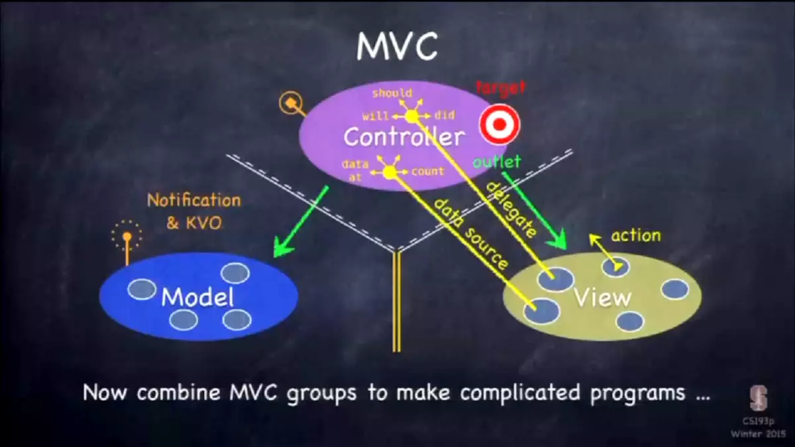

# MVC

当你开始着手开发一个iOS程序时，大致要做以下几个事情：定义概念和模型、设计用户界面和定义交互，具体一些包括：

* 定义概念和模型：我们应该清楚应用解决什么问题，给用户提供什么功能和内容
* 设计用户界面：给用户呈现出高效、简介和直观的界面
* 定义交互：即用户如何通过界面与应用的内容和功能进行交互

做这三件事情的时候，作为一个iOS程序员，其实就是在分别在编写Model、View和Controller的代码。



而码代码这件事情，不管是Swift还是Objective-C，都是在定义一堆类，以及类之间如何通过消息通信。

今天我们来讲一讲iOS开发中最重要的设计原则：MVC。

### MVC <a id="0"></a>

我们将一个iOS程序分为三个部分：Model、View和Controller。

* Model定义了你的应用程序是什么（What）的问题？具体一点说就是你的应用程序的业务逻辑和相关数据，而不是它们如何展现给用户。
* Controller定义了你的应用程序如何（How）展现给用户，也就是UI逻辑。
* View就是Controller控制的应用界面。

我们编写iOS程序，其实就是编写这三个部分，同时管理这三个部分之间的交互和通信。一组一组的MVC进一步组合起来就形成了复杂的应用程序。

我们基于一个简单的任务管理应用[Lean](http://tianmaying.com/tutorial/ios-mvc/repo)，来学习M，V和C之间的如何进行通信。之前的两个简单应用中，我们已经用到其中的一些通信方式。现在让我们再来梳理一下M、V和C之间交互。

### 按照MVC组织文件 <a id="1"></a>

为了更好的区分各个部分，我们为任务管理应用建立三个文件夹\(导航区：**右键-&gt;New Group**\)，分别命名为**Models**，**Views**和**Controllers**。

* **TodosTVC.swift**是Controller，将其拖入到**Controllers**文件夹内
* **TodoContentCell.swift**是View相关的代码，将其拖入到**Views**文件夹
* 其它所有的文件，我们都拖入到**Supporting Files**文件夹内
* Model文件夹放业务逻辑的相关的代码，这里我们将**TodoRepository.swift**放入，这个类负责Todo相关的操作（这里我们不管细节，比如是否操作数据库）

 提示

文件夹的组织可以直接通过文件和文件夹的拖动方便的完成。用触摸板的话，三指操作进行拖放非常方便，你需要在Mac中设置允许三指操作

### Controller-&gt;Model <a id="2"></a>

Controller可以直接调用Model。Model是体现业务逻辑和业务数据的地方，由于现阶段Model非常简单，其实我们甚至可以直接定义在Controller里头：

```text
var todoItems = ["吃饭", "睡觉", "抢银行"]
```

这条简单的语句其实就是现在的Model。虽然简单，现在我们来规范化一下，我们新建一个**TodoRepository**类（**File-&gt;New-&gt;File**，选择iOS Source下的Swift File）放到**Models**文件夹内，将Model相关的代码和Controller分开，这个类的代码如下： 

```text
import Foundation

class TodoRepository {
    
    func getAllTodos() -> [(String, NSDate)] {
        
        return [("吃饭", NSDate()), ("睡觉", NSDate().dateByAddingTimeInterval(86400)), ("抢银行抢银行抢银行抢银行抢银行抢银行抢银行抢银行抢银行抢银行抢银行抢银行", NSDate().dateByAddingTimeInterval(86400 * 2))]
    }
}
```

创建的`TodoRepository`类用来实现任务相关的业务逻辑和数据存取。将来这个类可能会有很多的方法，比如任务的增删改查等。任务模型更复杂之后（比如增加任务的截止日期），我们也需要专门的类来表示任务，而不仅仅是一个文本字符串。

这里我们让`getAllTodos`方法返回一个元组的数组，元组的第二个元素用来表示任务的时间。

Controller跟Todo交互的主要代码：

```text
var todoItems:[(String, NSDate)] = []

var todoRepository = TodoRepository()
    
//...
    
override func viewDidLoad() {
    super.viewDidLoad()
    
    //在View加载之后，展现之前，设置todoItems
    todoItems = todoRepository.getAllTodos()
}
```

`var todoRepository = TodoRepository()`在声明变量的同时进行初始化，这正是Controller对Model的直接调用，调用的是`TodoRepository`类的[构造器](http://numbbbbb.gitbooks.io/-the-swift-programming-language-/content/chapter2/14_Initialization.html)。

`todoItems = todoRepository.getAllTodos()`也是直接调用，调用的是`TodoRepository`的普通方法。

### Controller-&gt;View <a id="3"></a>

Controller可以直接访问View。

Storyboard中包含了MVC中**V**的大部分内容。一些自定义View对象的代码，我们通常将其放在**Views**文件夹内。比如，`TodoContentCell`类是一个`UITableViewCell`的子类，是`UIView`的简介子类，所以我们将其放在**Views**文件夹。

Controller对View的访问，我们在第二课中就见到过了，就是`Outlet`连接。`Outlet`除了我们自己在Storyboard中创建，很多情况下都是Xcode隐式为我们创建的，比如在对象库拖动一个**Table View Controller**，Controller对一个Table View的连接已经默认创建好了而且命名为了`tableView`，代码中我们可以通过`self.tableView`来对其访问。

我们看到，对Model和View的访问是一样的，在Controller的代码中，可以直接持有它们的类或者实例，进行方法和属性的访问。

### View-&gt;Controller <a id="4"></a>

View以什么方式跟Controller通信呢？ 首先我们应该清楚，View肯定不能持有某个特定Controller类或者其实例，这样就会特定于这个Controller了。比如UIView和UITableView都可以被任何Controller使用。

1. View与Controller通信的第一种方式是之前我们Hello World应用中已经用过的**Action**连接方式。当View中有用户动作时，会将这个**Action**告知Controller，Controller调用特定的方法来进行响应。

 提高

你可能会问那么View如何能通知到Controller呢？这就是iOS SDK为我们做的事情了，Controller的程序中都会有`import UIKit`，就是引入iOS SDK中的UIKit模块。UIKit模块会为APP建立一个端口，来接收iOS操作系统发送过来的用户界面操作的相关事件，事件都会在一个事件队列中排队，逐个等待分发，然后进入每一个iOS应用内部都会有一个运行时的主循环，最后识别成为某些View的某类事件（比如：一个Button的Tap Up Inside），然后调用对应的Controller方法。

1. 第二种情况是，当View的状态发生变化时，需要告知Controller，在Controller中有对应各种状态的回调方法（Controller的生命周期状态变化我们后面将会介绍）。比如我们刚刚写的`viewDidLoad`方法，其实就是表示视图处于已经加载的状态下，我们需要进行的操作。
2. View不能包含数据，但是View又要显示数据，如何处理呢？第三种情况就是，Controller充当View的数据源，这是通过协议来实现的。还记得`UITableViewDataSource`协议吧，`UITableViewController`实现该协议，并设置为`UITableView`的代理，为`UITableView`提供数据源。

   Controller可以直接与Model和View通信，因此Controller通常是从Model获取信息，并将其转化为可以被View识别的数据格式，从而提供给View展现。

### Model-&gt;Controller <a id="5"></a>

Model可以跟Controller直接对话吗？不行，Model是独立的，比如你的Todo模型的代码，将来应该可以应用到其他应用程序中去，不能特定于某个Controller。

如果Model希望自己的变化被Controller感知呢怎么办呢？iOS SDK提供了两种方法，第一种是类似于广播台，是一个事件发布/订阅系统：Model发生有意义的改变时，广播事件；而Controller去订阅特定类型的事件。应用内置的通知系统就可以将事件通知到Controller，让Controller进行响应。第二种是KVO\(Key Value Observing\)，也是一种类似的方法，它允许特定对象的某个属性的值发生变化时能自动通知到观察者。用到的时候我们会详细介绍。

### Model&lt;-&gt;View <a id="6"></a>

模型不应该拥有视图的信息，视图也不应该拥有模型信息.直观上也很容易理解，因为模型应该可以在不同的视图中展现，一个视图也应该可以展现各种模型。因此，两者之间应该分离开。

 注意

Model和View不应该相互通信，这是基本的设计原则。

