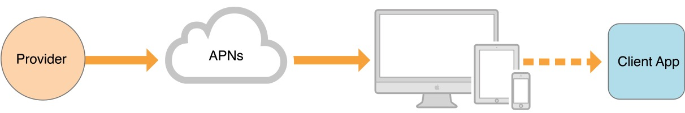

# APNs

先说一下远程推送，一般我们有自己的服务器，在这个过程中是Provider的角色，如图，推送从我们的服务器到我们的APP的过程就是要通过APNs来发送。



APNs\(Apple Push Notification service\)是远程推送功能的核心，通过APNs客户端和苹果服务器建立一个长连接，推送也是通过这个长连接发送到客户端上。

### deviceToken

deviceToken是设备的一个标识符，属于你这款APP装在你这个设备上的标识符，即每个APP在每一个不同的设备上都有着不同的deviceToekn，通过注册远程推送服务，APNs会返回给你的APP的deviceToken，用于开发的APNS服务器每次安装app时返回的deviceToken都不同，如图


在项目的AppDelegate里面有一个方法，如果成功注册了便可以接收到deviceToken。

```objectivec
- (void)application:(UIApplication *)application didRegisterForRemoteNotificationsWithDeviceToken:(NSData *)deviceToken
```

deviceToken不是唯一确定的，当你的设备更新了系统然后deviceToken就会改变。

