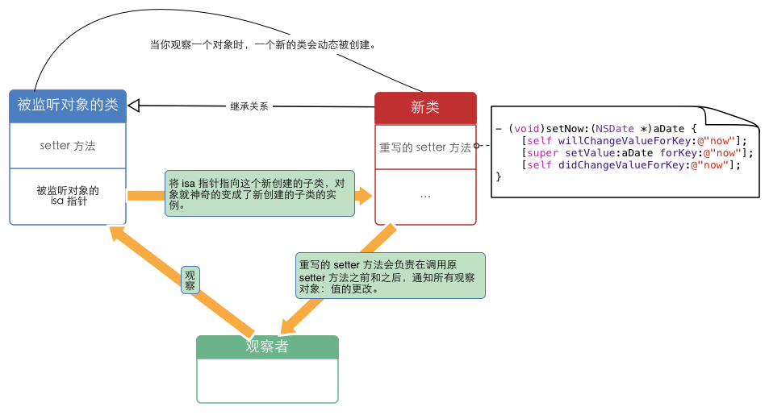

# KVO、KVC

## 1、KVC\(Key-Value Coding\)

在网上查的很多资料都说KVC运用了isa-swizzling技术（将2个对象的isa指针互相调换），但是我并没有发现isa-swizzling的踪迹。

如下的一行KVC的代码：

```objectivec
[joy setValue:@"beautiful"forKey:@"appearance"];
```

就会被编译器处理成：

```c
SEL sel = sel_getUid("setValue:forKey:");

IMPmethod = objc_msg_lookup (site->isa,sel);

method(site, sel, @"sitename",@"name");
```

具体主要分为三大步:

* 第一步：寻找该属性有没有setsetter方法？有，就直接赋值
* 第二步：寻找有没有该属性带下划线的成员属性？有，就直接赋值
* 第三步：寻找有没有该属性的成员属性？有，就直接赋值

或者这么说:

* 1、首先搜索setKey:方法.\(key指成员变量名, 首字母大写\)
* 2、上面的setter方法没找到, 如果类方法accessInstanceVariablesDirectly返回YES. 那么按 \_key, \_isKey，key, iskey的顺序搜索成员名.\(NSKeyValueCodingCatogery中实现的类方法, 默认实现为返回YES\)
* 3、如果没有找到成员变量, 调用setValue

## 2、KVO \(Key-Value Observing\)

### **1）、KVO \(Key-Value Observing\)**

KVO 是 Objective-C 对观察者模式（Observer Pattern）的实现。也是 Cocoa Binding 的基础。是通过`isa-swizzling`来实现的。当被观察对象的某个属性发生更改时，观察者对象会获得通知。

### **2）、KVO内部实现原理**

* KVO是基于runtime和isa-swizzling机制实现的。
* 当某个类的属性对象**第一次被观察**时，系统就会在运行期**动态**地创建**该类的一个派生类**，在这个派生类中重写基类中任何被观察属性的setter 方法。派生类在被重写的setter方法内实现真正的**通知机制**。如果原类为Person，那么生成的派生类名为**NSKVONotifying\_Person**。
* 每个类对象中都有一个isa指针指向当前类，当一个类对象的第一次被观察，那么系统会偷偷将isa指针指向动态生成的派生类，从而在给被监控属性赋值时执行的是派生类的setter方法。
* 键值观察通知依赖于NSObject 的两个方法: `willChangeValueForKey:` 和 `didChangevlueForKey:`；在一个被观察属性发生改变之前， `willChangeValueForKey:`一定会被调用，这就 会记录旧的值。而当改变发生后，`didChangeValueForKey:`会被调用，继而_`observeValueForKeyPath`_`:ofObject:change:context:` 也会被调用。
* 补充：KVO的这套实现机制中苹果还偷偷重写了class方法，让我们误认为还是使用的当前类，从而达到隐藏生成的派生类。



### **3）、手动触发一个value的KVO**

* **自动触发的场景**：在注册KVO之前设置一个初始值，注册之后，设置一个不一样的值，就可以触发了
* **手动触发演示**：需要手动调用两个方法

```objectivec
@property (nonatomic, strong) NSDate *now;

- (void)viewDidLoad
{
    [super viewDidLoad];

    // “手动触发self.now的KVO”，必写。
    [self willChangeValueForKey:@"now"];

    // “手动触发self.now的KVO”，必写。
    [self didChangeValueForKey:@"now"];
}
```

### **4）、关闭默认的KVO的实现，并进入自定义的KVO实现**

[如何自己动手实现 KVO](https://link.jianshu.com/?t=http://tech.glowing.com/cn/implement-kvo/)

