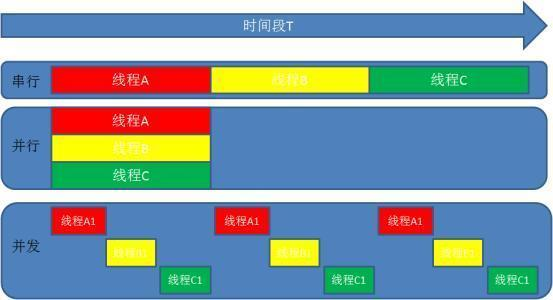

# Thread

**同步、异步**：  
指的是能否开启新的线程。同步不能开启新的线程，异步可以。  
**串行、并行**：  
串行是指一个处理器同时处理多个任务时，各个任务按顺序执行，完成一个之后才能进行下一个，串行的任务在一个线程中执行。  
并发是指一个处理器同时处理多个任务时，同时处理多个不同的任务。  
并行是指多个处理器或者是多核的处理器同时处理多个不同的任务。  
并发是逻辑上（多线程）的同时发生，而并行是物理上（多核多线程）的同时发生，并行和并发只在异步函数下有效。

